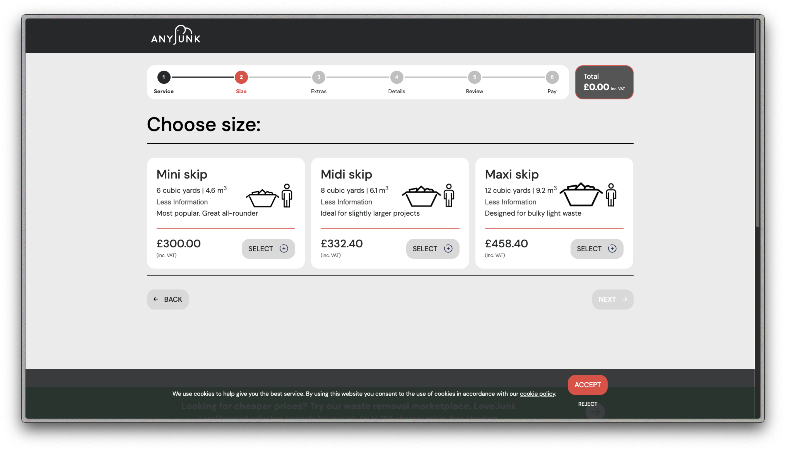
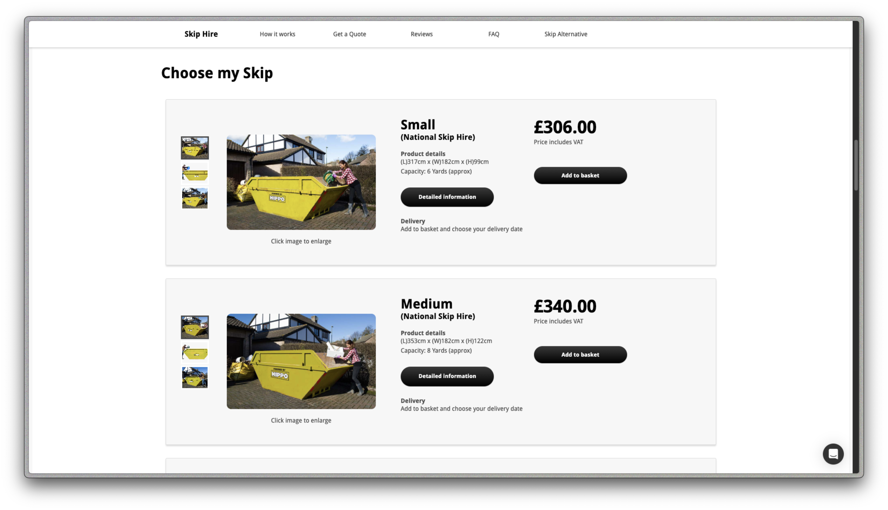
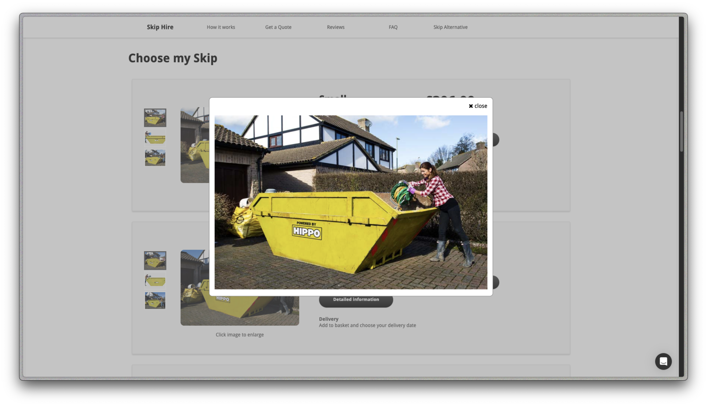
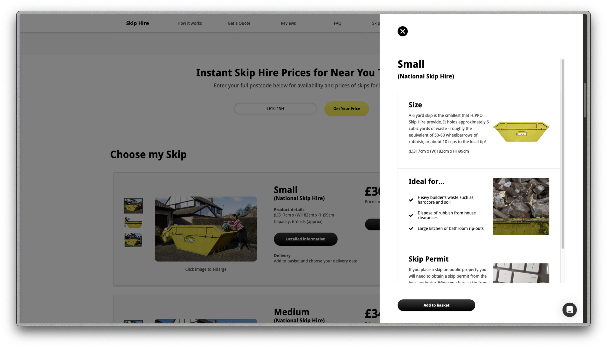
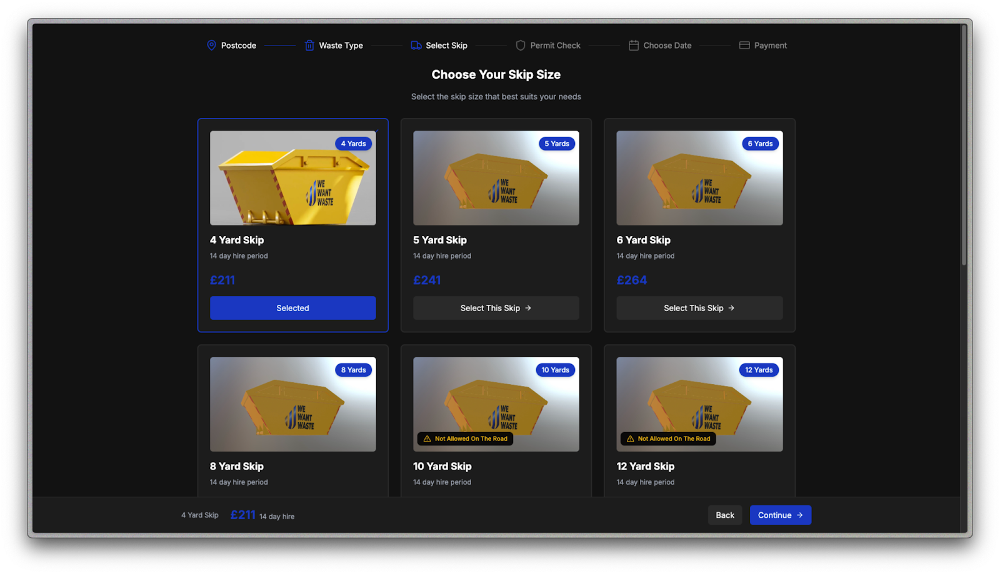
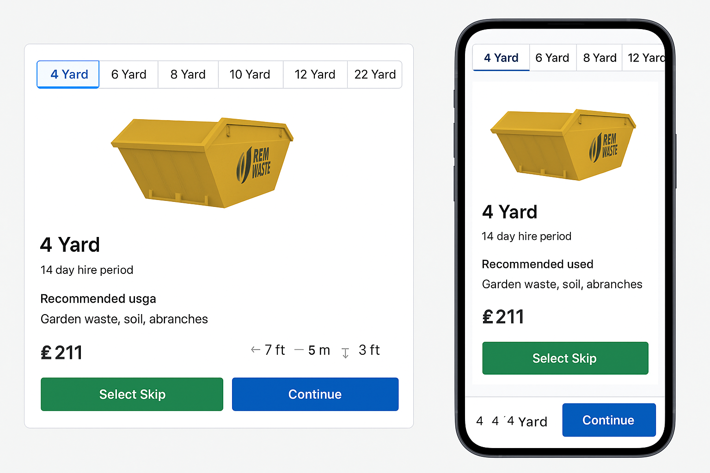

# remwaste-react-app (REM Waste – Redesign Challenge / Technical Test)

Before diving into visual changes or code, I decided to take a step back and understand the context around the task. What is the nature of the waste management industry? Where does REM Waste sit within that landscape? Who are the real people using this skip selection interface, and what do they expect when landing on this page?

This README outlines the thinking behind my approach — combining user experience, technical clarity, and professional tone — to improve both the form and function of the skip selection experience.

## Understanding the Industry and Where REM Waste Falls In

I started by learning about the waste management industry and turns out, it involves many steps and different people working together. In the waste management industry, I learn that there are typically multiple stages in the supply chain:

1. **Waste Generation** – at homes, construction sites, or commercial operations
2. **Waste Collection** – temporary storage or containerization of waste (e.g., skips)
3. **Transportation** – moving collected waste to processing centers
4. **Sorting & Segregation** – identifying recyclables, hazardous waste, etc.
5. **Treatment** – processes like incineration or gasification 6. Disposal or Recycling – landfill or material recovery

Each of these stages can be handled by different entities and understanding where REM Waste fits in this system helped me better understand who their **target audience** is and conduct a proper UX approach.

REM Waste functions as a digital logistics layer, coordinating skip delivery, pickup, and disposal by connecting customers with a wide network of skip providers. Their service focuses primarily on the **collection and transportation** stages which bridging the gap between those who produce waste and those who process it.

### Estimated Target Audience

Based on what I’ve learned, I can estimate that REM Waste primarily serves professional users who need efficient skip logistics. The LinkedIn profile also mentions:

_"REM Waste operates in the Waste Management UK sector partnering with over 750 different organisations delivering and supporting companies from construction, engineering, demolition, insulation to domestic households."_
– REM Waste LinkedIn

This indicates a **broad customer base**. From that, I can safely assume their main audience includes:

- Site Managers
- Contractors (landscaping, building, renovation)
- Property Maintenance Professionals
- SME-level businesses seeking reliable skip logistics
- Individual Households

These users likely value ease, speed, clarity, and confidence when selecting the right skip for a job.

## Competitor Analysis / Benchmarking

To better understand what works (and what’s missing) in the industry, I some of the UK skip platforms such as AnyJunk and HIPPO. These were my findings:

### AnyJunk



- Highlights skip dimensions, helping users assess which skip is right for their specific needs
- Clean layout, but minimal contextual guidance

### HIPPO



- Presents all essential product information in a single, easy-to-scan layout
- Clearly displays skip dimensions to help customers quickly evaluate suitability
- Offers hover-based image previews for fast visual inspection



- Allows users to enlarge product images for greater visual detail and clarity



- Provides detailed product descriptions and specifications
- Includes skip usage recommendations to guide users on appropriate applications
- Mentions permit requirements (a minor touchpoint, but still helpful — also covered by REM Waste later in the flow)

With these references, I was able to establish a clear benchmark of what works well in the market. Both in terms of usability and the type of information customers expect during the skip selection process.

## REM Waste Skip Selection Page Problem Analysis



### Strengths

- A wide range of skip options (more than competitors)
- Clean, minimal flow (choose + continue)
- Responsive layout across devices
- Good progression tracking with steps indicator

### Room for Improvement

- No dimensions, usage hints, or visuals to help select quickly
- Product mockups instead of real photos
- Important data buried or delayed until later
- Long vertical scroll on mobile for comparing skips

---

## Redesign Goals

I set the following goals to guide my implementation:

1. **Improve decision-making speed**

   - Show size, dimensions, and usage context up front

2. **Support professional-grade clarity**

   - Replace playful icons with real skip photos or clean illustrations

3. **Minimize effort to compare options**

   - Responsive layout makes products comparable at a glance

4. **Boost confidence with tooltips & context**

   - Help users who don’t know which size they need

5. **Design for all devices**

   - Functional, clear, and accessible from phones to large desktops

6. **Respect existing brand**

   - I kept the same core colors and visual tone, avoiding jarring visual changes

### Mock Data Enrichment

Although the provided API contains essential skip data, I decided to enrich the user experience by enhancing this dataset with additional mock information. This is stored under `/src/data/index.ts` and injected after the initial fetch like this:

```
fetchSkips()
  -> fetch base skip data from API
  -> map each skip using enrichSkip()
      -> append description
      -> append recommendations
      -> append dimensions
      -> append images
```

#### What’s inside the mock data:

1. **`skipRecommendations`**

   - Short usage tips for each skip size to help users make quick decisions. These are not technical specifications, but simple examples of common use cases meant to support users. Especially those unfamiliar with skip hire to allow them selecting the right option with more confidence.\*

     \*The suggestions are provided purely as contextual guidance to enhance the user experience, not as expert advice or official recommendations.

2. **`skipDescriptions`**

   - Plain English descriptions explaining capacity and ideal use cases, designed to match mental models like "30–40 bin bags" which I collected from REM Waste main website (https://remwaste.com).

3. **`skipDimensions`**

   - Standardized width, height, and length in both metric and imperial units which I collected from REM Waste main website (https://remwaste.com) to cater to different user preferences and provide full context.

4. **`skipImages`**

   - Each skip includes a mix of side-view illustrations and blueprint-style visuals to enhance clarity. While I previously noted the absence of real product images on the original page, I didn’t have access to official assets either. So, I used internet-sourced visuals to simulate how detailed imagery could support decision-making and create a more polished user experience.

📌 While injecting static mock data after fetch isn’t ideal in a real-world environment (where such data should inside the database), this method is chosen to maintain separation and make testing easy during development.

### Introduced Features and Component Enhancements

#### 1. **Dynamic Unit Metrics**

Users can toggle between Metric and Imperial units when viewing skip dimensions. This supports the diversity in measurement familiarity and aids decision-making speed.

#### 2. **Tooltip for Recommendations**

Lightweight tooltips show helpful “Ideal for...” suggestions tailored to each skip, improving user clarity and helping users choose more confidently.

#### 3. **VAT Pricing Note**

The UI clearly states that the shown price excludes VAT. While the original REM Waste website calculates VAT at the final step of the checkout process, providing this information at the skip selection stage improves transparency and helps users set more accurate expectations upfront.

#### 4. **Interactive Image Carousel**

Each skip includes a carousel of images that users can swipe or click through. The carousel also supports image enlargement, offering a more interactive and informative product visualization.

#### 5. **Confirmation Modal**

Before progressing, users are shown a modal summarizing the skip details. This builds clarity and trust, ensuring users know what they’re committing to.

These enhancements are all designed to support the core UX goals: **speed**, **clarity**, and **trust** which would help REM Waste's customers book the right skip quickly and confidently.

## Experimental Enhancement: AR Skip Preview

As a forward-thinking addition, I explored the possibility of integrating an Augmented Reality (AR) feature into the skip selection page. While this feature is entirely non-blocking and not required for completing the task, it demonstrates an initiative to bridge the gap between digital selection and physical understanding — especially helpful for less experienced users or domestic audiences.

### Why AR?

One of the common challenges in skip hire is spatial understanding: “Will this skip actually fit on my driveway?” or “How big is 8 yards, really?”

To answer that, I experimented with AR to let users preview the skip size in their physical space through their phone camera — adding clarity, realism, and confidence.

---

### How It Works

- A dedicated **"View in AR"** button is shown **only on mobile devices**.
- Once clicked:
  - iOS users are redirected to a `.usdz` file using Apple’s native Quick Look AR system.
  - Android users are taken to a dedicated HTML page rendering a `.glb` model via [Model Viewer](https://modelviewer.dev) with support for Scene Viewer.
- The AR viewer runs in a **new browser tab** so it doesn't interrupt the main selection or checkout process.

---

### Tech Stack & Tools Used

- `@google/model-viewer` (for Android AR support)
- Apple Quick Look with `.usdz` format (for iOS support)
- Device and OS detection via `navigator.userAgent`
- 3D models downloaded and scaled appropriately using SketchUp and online converters

---

### Known Limitations

- Not all mobile devices support AR natively.
- 3D models are not **dynamically scaled** based on skip dimensions. This approach was taken purely to enhance the user experience, not to guarantee exact measurements.
- As this was developed during a limited time frame, models are simplified and not yet tied to real-time data though this is feasible in future iterations.

## Visual Identity Consideration

### Color Palette

The following colors were extracted directly from the existing REM Waste website using the **ColorZilla** browser extension. Since there was no publicly available **brand guideline or design system** (such as a style guide or brand book), I based the palette on the colors actively used in their digital interface to stay visually aligned with their current branding.

```css
--color-primary: #0037c1;
--color-primary-light: #e5e7eb;
--color-primary-dark: #2a2a2a;
--color-secondary: #eab308;
--color-secondary-light: #9ca3af;
--color-secondary-dark: #121212;
--color-white: #ffffff;
--color-black: #000000;
--color-gray-800: #1c1c1c;
```

### Layout Concept



- Visual AR preview entry point (mobile-only)
- Tooltip with real image preview + usage recommendations
- Dynamic carousel of skip images (real + blueprint style)

## Project Structure & Stack

### Tech Stack

- React (Vite)
- TypeScript
- Tailwind CSS
- Ant Design (modals, carousel)
- `@google/model-viewer` for Android AR
- QuickLook for iOS AR

### Environment Variables

To run the project locally, environment variables must be configured in a .env file.

A .env.sample file is provided to serve as a reference. Follow the steps below to get started:

#### Steps

1. Copy the .env.sample file and rename it to .env:

```bash
cp .env.sample .env
```

2. Update the values as needed (if you’re using a different API endpoint, for example).

   Notes:

   • Vite requires all environment variables to be prefixed with VITE\_.

   • Be sure to restart your dev server after making any changes to .env.

### Technical Approach

As the instruction mentioned — "Focus on clean, maintainable React code, responsiveness, and UI/UX improvements" — I’ve taken a very intentional approach in structuring and writing this project:

- **Modular Component Structure**: Organized using Atomic Design to maintain clarity and scalability.
- **Separation of Concerns**: Data mapping, utility functions, API calls, and presentation logic are kept cleanly separated.
- **Responsive Design**: All components and layouts are designed to work across various screen sizes, from mobile to large desktops.

### Folder Structure

```
src/
├── api/                  // Contains all API service calls (e.g. fetchSkips)
├── assets/               // Static assets (e.g. icons, svg logos)
├── components/           // UI components organized via Atomic Design
│   ├── atoms/            // Fundamental UI components (e.g. Button, Tooltip, Tag)
│   ├── molecules/        // Composed units (e.g. SkipDisplay, Carousel)
│   └── organisms/        // Page-level structures (e.g. SkipTabs, Footer)
├── data/                 // Enriched data stored as local mock information
├── mapping/              // Local mappings (e.g. descriptions, dimensions, recommendations)
├── pages/                // Route-level views (e.g. SkipSelectionPage)
├── templates/            // Placeholder layouts (scaffolded for future)
├── types/                // TypeScript types and shared interfaces
├── utils/                // Utility/helper functions (e.g. isMobile, OS detection)
```

## How to Run Locally

```bash
git clone https://github.com/agriyantosk/remwaste-react-app.git
cd remwaste-react-app
npm install
npm run dev
```

## Links

- **Live Deployment**: [_Deployment Link_](https://remwaste-react-app.vercel.app/)

- **Sandbox Link**: [_Sandbox Link_](https://codesandbox.io/p/github/agriyantosk/remwaste-react-app/draft/condescending-noyce)
